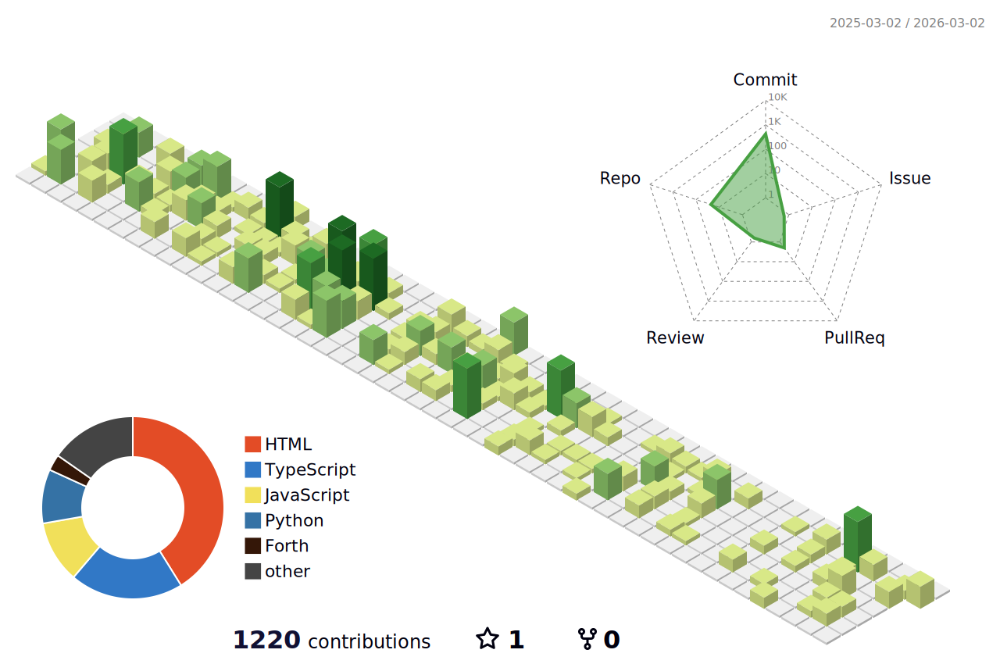

<!-- Header Bilingual -->

  <h1>🌨️🌧️❄️ Glória Maria ❄️🌧️🌨️</h1>
  
🎧🌧️❄️🏔️🌲~ Victor❤️Glória

  <h4>🇺🇸 Tech. IT | Systems Analysis and Dev | Cartographic and Surveying Engineering   🇧🇷 Tec. Informática | Análise e Desenvolvimento de Sistemas | Engenharia Cartográfica e de Agrimensura</h4>
   

  

---

   
    <h3><b>📊 🇺🇸 Summary Cards | 🇧🇷 Cartões de Resumo </b></h3>

  
  
  
  
   

---

 

  <h3><b>About Me </b></h3>

 

#### 🎓 Education

- **🏦 UFPR** (Brasil/Brazil) 
  `🗺️🛰️ Bachelor's in Cartographic Engineering` 

- **💒 PUCPR** (Brasil/Brazil) 
  `💻🐙 Technologist in Systems Analysis & Development` 
  `🎓 Computer Technician`

 

#### 🛠️ Skills

    
    
    
    
    
    
    

  

#### 🎨 **Design Preferences**
##### Color Palette:
           

 

#### 🎮🎹 Other Interests
  Piano, Gaming, Arts, Paleontology, Fashion, Sewing, Aquarism, Botany

