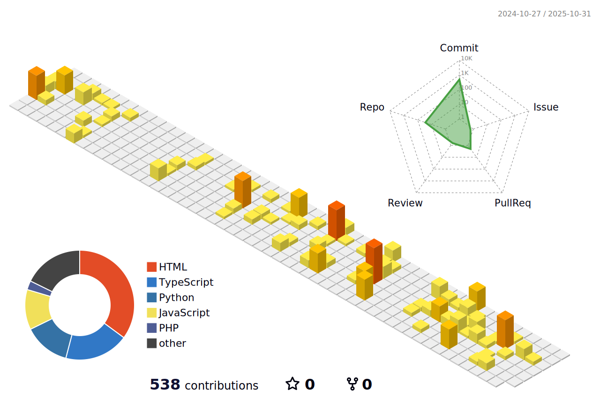

<!-- Header Bilingual -->

  <h1>🌨️🌧️❄️ Glória Maria ❄️🌧️🌨️</h1>
  
🎧🌧️❄️🏔️🌲~ Victor❤️Glória

  <h4>🇺🇸 Tech. IT | Systems Analysis and Dev | Cartographic and Surveying Engineering | Aspiring Artist   🇧🇷 Tec. Informática | Análise e Desenvolvimento de Sistemas | Engenharia Cartográfica e de Agrimensura | Artista Aspirante</h4>
  
  
  

  

   

---

   
    <h3><b>📊 🇺🇸 Summary Cards | 🇧🇷 Cartões de Resumo </b></h3>
  
  
  
  
   

---

  <h3><b>🇺🇸 About Me | 🇧🇷 Sobre Mim </b></h3>
  
  

 

#### 🎓 🇺🇸 Education | 🇧🇷 Formação Acadêmica

- **🦠UFPR** (Brasil/Brazil) 
  🇺🇸 `🗺️🛰️ Bachelor's in Cartographic Engineering | QGIS | Python` 
  🇧🇷 `Engenharia Cartográfica e de Agrimensura | QGIS | Python`

- **💒 PUCPR** (Brasil/Brazil) 
  🇺🇸 `💻🙠Technologist in Systems Analysis & Development | Vue.js | React` 
  🇧🇷 `Análise e Desenvolvimento de Sistemas | Vue.js | React`

*🇺🇸 `📠Computer Technician` (IT integrated with HS at PUCPR)* 
*🇧🇷 `Técnico em Informática integrado ao Ensino Médio (PUCPR)*

 

#### 🛠️ Skills & Ferramentas
##### 💻 🇺🇸 Technologies | 🇧🇷 Tecnologias

##### 🗺️ 🇺🇸 Geotechnologies | 🇧🇷 Geotecnologias

 

#### 🎨 🇺🇸 **Design Preferences** | 🇧🇷 **Preferências Visuais**
##### Color Palette:
 
  
  
  

 

  <h4><b>🎮🎹 🇺🇸 Other Interests | 🇧🇷 Outros Interesses</b></h4>
  <table>
    <tr>
      <th>🇺🇸</th>
      <th>🇧🇷</th>
    </tr>
    <tr>
      <td>Piano</td>
      <td>Piano</td>
    </tr>
    <tr>
      <td>Gaming</td>
      <td>Jogos</td>
    </tr>
    <tr>
      <td>Arts</td>
      <td>Artes</td>
    </tr>
    <tr>
      <td>Paleontology</td>
      <td>Paleontologia</td>
    </tr>
    <tr>
      <td>Fashion</td>
      <td>Moda</td>
    </tr>
    <tr>
      <td>Sewing</td>
      <td>Costura</td>
    </tr>
    <tr>
      <td>Aquarium Hobby</td>
      <td>Aquarismo</td>
    </tr>
    <tr>
      <td>Botany</td>
      <td>Botânica</td>
    </tr>
  </table>

--- 

  <h3><b>🌟 🇺🇸 Projects | 🇧🇷 Projetos</b></h3>
  
  

   

  [-B8E3FF?style=flat-square&logo=openstreetmap&logoColor=black)](https://gloriadeitos.github.io/ufpr-sig/)
  [-B8E3FF?style=flat-square&logo=databricks&logoColor=black)](https://gloriadeitos.github.io/pucpr-webdev-basics/)
  [-d1edff?style=flat-square&logo=spacex&logoColor=black)](https://gloriadeitos.github.io/pucpr-applied-comm/)

 

#### 📌 🇺🇸 In Progress | 🇧🇷 Em Progresso  

-  **[ufpr-adjustment (Repository Link | Link do Repositório)](https://github.com/gloriadeitos/ufpr-adjustment)**

  <b>🇺🇸</b> Um modelo Typst para geração de relatórios técnicos seguindo os padrões de formatação ABNT da UFPR. Fornece formatação acadêmica adequada para artigos de pesquisa e documentação técnica.
    
  <b>🇧🇷</b> A Typst template for generating technical reports following UFPR's ABNT formatting standards. It provides appropriate academic formatting for research articles and technical documentation.

---

  
<b>🇺🇸 Note:</b> the icons used in the badges are from: | <b>🇧🇷 Obs:</b> os ícones utilizados nos badges são do: <a href="https://simpleicons.org/" target="_blank"><b>Simple Icons</b></a>.

---

  <h3><b>🌐📬 🇺🇸 Connect | 🇧🇷 Contato</b></h3>

  
<b>🇺🇸</b> Button-shaped links | <b>🇧🇷 </b> Links em botões

